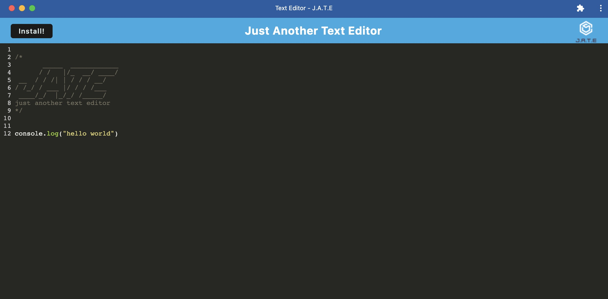

  Just Another Text Editor 

## Description

In this homework assignment I created a Progressive Web App (PWA) using existing file structure given to us and building out the back-end side while implenting storage using IndexedDB.

## Table of Contents

- [Usage](#usage)
- [Links](#LINKS)
- [Media](#media)
- [Questions](#questions)
- [License](#license)

## Usage

Open on the deployed Heroku link and click "Install" or use the install feature on the URL bar to download app to your desktop/laptop or mobile device.

## LINKS

[Deployed Heroku Link](https://mg-pwa-text-editor.herokuapp.com/)

[GitHub Repo Link](https://github.com/mattgrogandev/text-editor)

## Media

## Questions

If you have any questions regarding this project please contact either on GitHub or by Email below.

GitHub: [mattgrogandev](https://github.com/mattgrogandev)

Email: mattgrogan.dev@gmail.com

## License

Licensed under the MIT license.

[Link to opensource.org license info](https://opensource.org/licenses/MIT)
